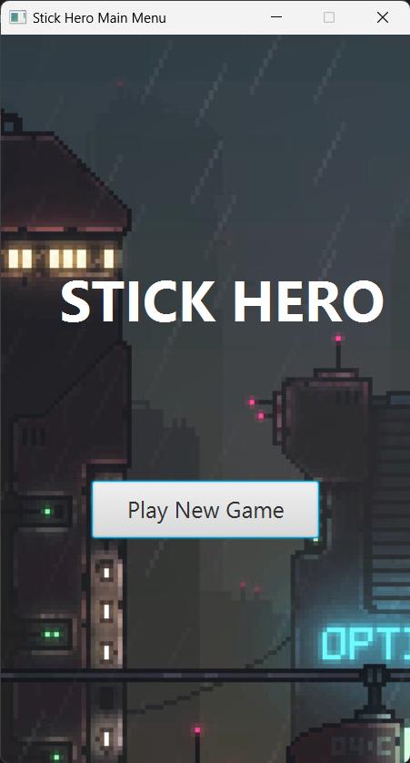
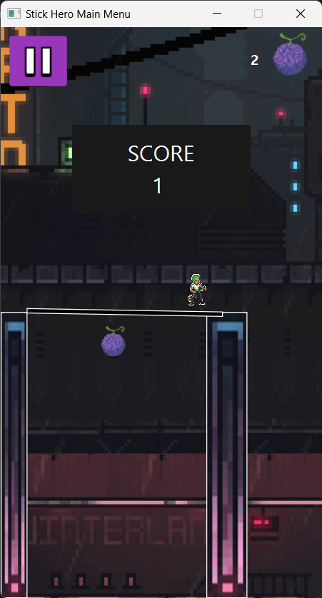
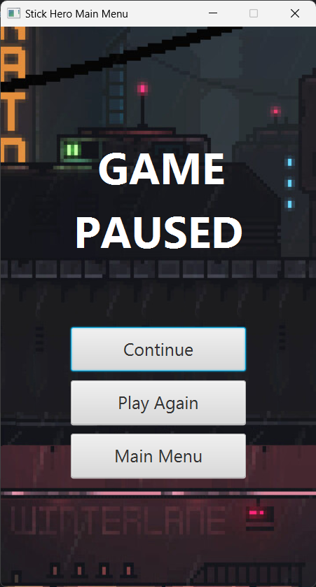
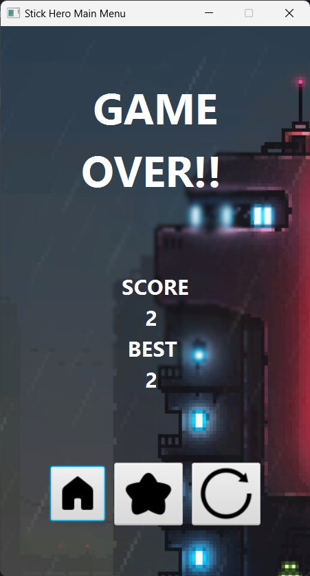

# GROUP - 90

1. HIMEKSH MALHOTRA, 2022218
2. LAKSHAY KUMAR, 2022266

# Stick Hero Game

Stick Hero Game is a JavaFX-based 2D platformer that challenges players with precise timing and coordination. In this game, a stick-wielding ninja navigates between pillars by extending and rotating a stick. The project includes various features such as a main menu, dynamic stick mechanics, score tracking, collectible cherries, pause functionality, and an end screen.

## Table of Contents

1. [Introduction](#introduction)
2. [Game Features](#game-features)
3. [Classes Overview](#classes-overview)
4. [How to Play](#how-to-play)
5. [Screenshots](#screenshots)
6. [Getting Started](#getting-started)
7. [Dependencies](#dependencies)
8. [License](#license)

## Introduction

Stick Hero Game provides an engaging and challenging gaming experience. Players control a ninja character, attempting to jump between pillars using a stick. The game introduces dynamic stick length and rotation mechanisms, creating a unique and entertaining gameplay dynamic.

## Game Features

### 1. Dynamic Stick Length

The stick dynamically increases in length as the player holds the mouse button, and the challenge is to release it at the right time to bridge the gap between pillars.

### 2. Rotation Mechanism

The stick rotates during gameplay, allowing players to adjust its angle mid-air for precise landings on the next platform.

### 3. Cherries

Cherries appear on specific pillars, providing an opportunity for players to earn extra points by collecting them during their jumps.

### 4. Score System

The game features a scoring system, tracking the player's performance based on successful jumps and cherry collections.

### 5. Pause and End Screens

Players can pause the game at any point, accessing a pause screen with options to continue playing, restart, or return to the main menu. After completing a game, an end screen displays the final score and options to play again or return to the main menu.

## Classes Overview

### 1. Game

Manages the overall game, including scenes, pillars, ninja, stick, cherries, and score.

### 2. GameData

Holds essential game data, including the ninja, stick, score, and layout spacer.

### 3. Ninja

Represents the ninja character, responsible for flipping and falling animations.

### 4. Stick

Represents the stick used by the ninja, providing functionality for extending, rotating, and timing.

### 5. RandomPillarGenerator

Generates random pillars during gameplay and manages their transitions.

### 6. Pillar

Represents the pillars that the ninja jumps between.

### 7. MainMenuApp

Creates the main menu screen with a play button and title.

### 8. PauseScreen

Displays options to continue, play again, or return to the main menu during a pause.

### 9. EndScreen

Shows the player's score and offers options to play again or return to the main menu after the game ends.

### 10. ScreenFactory

A factory class for creating different screens (e.g., PauseScreen, EndScreen).

## How to Play

1. **Main Menu**: Click "Play New Game" to start the game.

2. **Gameplay**: Click and hold the mouse to extend the stick. Release to jump between pillars. Time the jumps and stick rotations to land safely.

3. **Pause**: During gameplay, click the pause button to access the pause screen.

4. **Pause Screen**: Choose to continue, play again, or return to the main menu.

5. **End Screen**: After a game over, view your score and choose to play again or return to the main menu.

## Screenshots

## Getting Started

1. Clone the repository: `git clone https://github.com/Darkclaw1704/Omnitrix.git`

2. Open the project in your preferred Java IDE.

3. Run the `Main` class to start the game.

